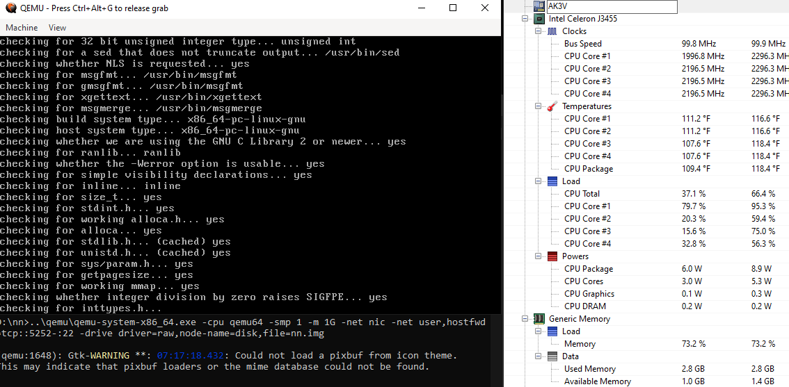

This provides a root filesystem that boots up in QEMU.  It is the base LFS 11.2 install, using [Luís Mendes's build scripts](https://github.com/luisgbm/lfs-scripts).  

It was built with QEMU in qemu64 cpu mode, so it should run fine on modern x86_64 processors.  Rebuild the system for your host using [N🚫NIC](https://nonic.org) to gain performance, if you wish, by using -cpu host.  Note that you will sacrifice portability. 

Run `sh launch_first.sh` once to create a fresh OS.  It will extract the img for the root filesystem, run an MD5 check, and launch QEMU.  I'm using Ubuntu 22.04 with QEMU, but any recent GNU/Linux system should work fine.  

Use root/password for login.

[LFS Credits](https://www.linuxfromscratch.org/credits.html)

